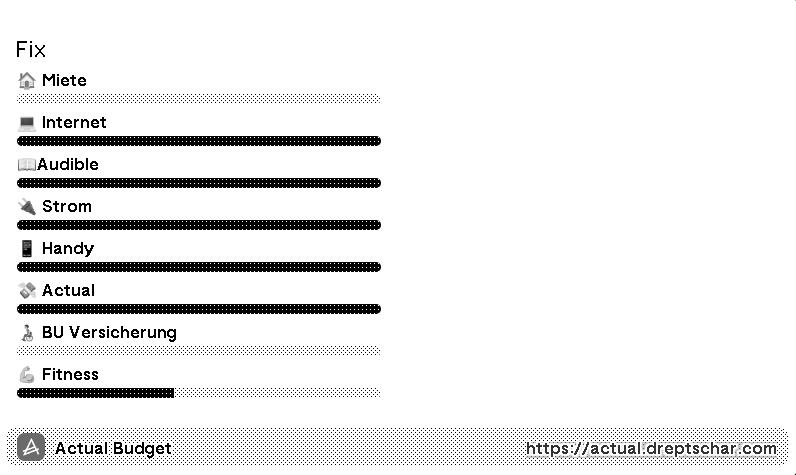

# trmnl-actual-plugin-server

Backend server for a **TRMNL** plugin that shows selected category balances from [Actual Budget](https://actualbudget.org).



## What it does

The server exposes one endpoint:

- `POST /api/markup`

It receives credentials and budget parameters, loads data via `@actual-app/api`, filters the categories for the selected group, and returns a JSON payload for the TRMNL client.

## Runtime Architecture

- Go HTTP server: [`main.go`](main.go)
- Go calls Node script: [`script.js`](script.js)
- Node uses Actual API wrapper: [`actual.js`](actual.js)

Current startup command:

```bash
npm start
```

This runs:

```bash
go run main.go
```

## API Contract

### Endpoint

`POST /api/markup`

### Request body

```json
{
  "serverURL": "https://actual.example.com",
  "serverPassword": "your-actual-server-password",
  "budgetSyncId": "00000000-0000-0000-0000-000000000000",
  "budgetEncryptionPassword": "optional-budget-password",
  "groupName": "Flexi",
  "included": "Category A,Category B"
}
```

### Validation

The API validates:

- `serverURL` is required and must be a valid `http/https` URL
- `serverPassword` is required
- `budgetSyncId` is required and must be a valid UUID
- `groupName` is required

### Response behavior

Important: the endpoint always responds with HTTP `200`.

- Success: JSON payload with data
- Failure: JSON object with an `error` field

Example error response:

```json
{
  "error": "invalid request payload: serverURL is required"
}
```

## Local Development

Install dependencies:

```bash
npm install
```

Run server:

```bash
npm start
```

Default address:

- `http://localhost:8080`

## Docker

Build and run with Docker Compose:

```bash
docker compose up --build
```

Or use the published image:

- `dreptschar/trmnl-actual-plugin-server:latest`
